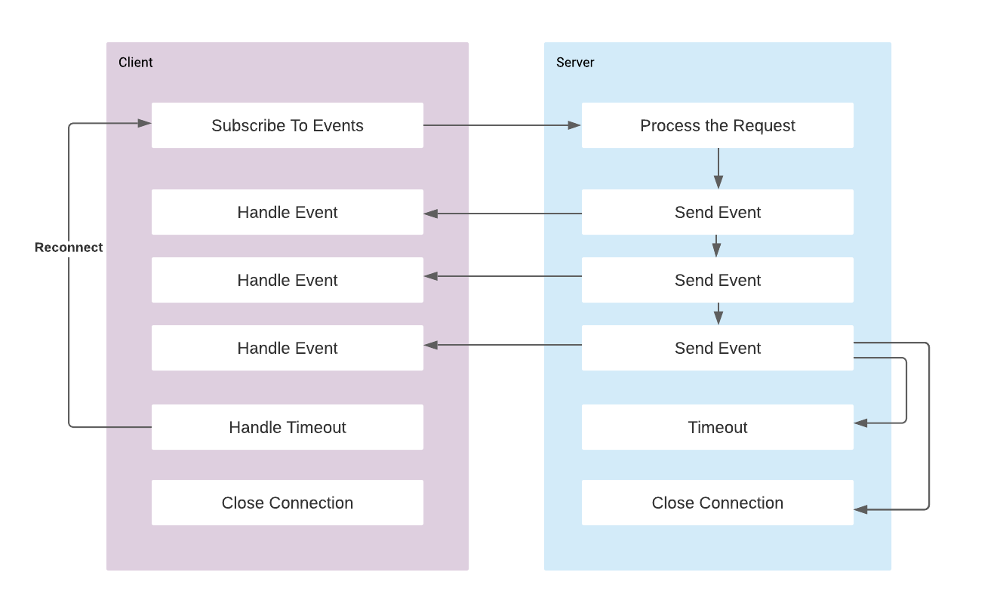

# server-sent-event

Server Sent Events (SSE) is an HTTP standard that provides the capability to servers to push streaming data to client. 

The flow is unidirectional from server to client and client receives updates when the server pushes some data. 

